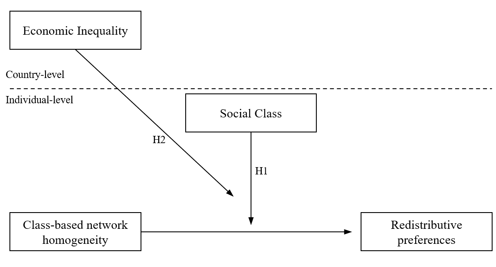

```{r render, include=FALSE, eval=FALSE}
rmarkdown::render("paper1_jiturra.Rmd", output_format = "bookdown::pdf_document2")
rmarkdown::render("paper1_jiturra.Rmd", output_format = "bookdown::html_document2")
rmarkdown::render("paper1_jiturra.Rmd", output_format = "bookdown::word_document2")
```


```{r setup, include=FALSE}
if (!require("pacman")) install.packages("pacman")  #si falta pacman, instalar
if (!require("tinytex")) install.packages("tinytex")#si falta tinytex, instalar
pacman::p_load(knitr, kableExtra, dplyr, ggplot2,sjmisc,texreg) # librerias
knitr::opts_chunk$set(warning = FALSE,  # mensaje de warning
                      message = FALSE,  # mensajes/avisos de librerias  
                      cache = T,    # cache de los chunks,usar analisis pesados
                      out.width = '100%',
                      fig.pos= "H",     # posicion figuras H = HERE
                      fig.align = "center",
                      echo = FALSE      # incluir chunk en output
                      )
options(scipen=999) # notacion cientifica
rm(list=ls())       # limpiar workspace
options(knitr.kable.NA = '') # NA en kable = ''  
```
\pagestyle{fancy}
\fancyhead[R]{\thepage}
\fancyhead[L]{Research Article Draft}

```{r include=FALSE, cache=FALSE}
wordcount<- rmdwc::rmdcount(files = "paper1_jiturra.Rmd") 
wordcount$words
```

**Word count**:  `r wordcount$words`

\pagebreak 

# Introduction  

Over the past few decades, cross-national studies on social class and redistributive preferences have predominantly centered on individual class positions [@lindh_class_2020]. Recently, however, a growing body of research has begun to focus on how the class profile of social networks influences redistributive preferences [@lindh_missing_2021; @lee_consider_2023; @paskov_crossclass_2022]. Although prior studies have shown that class-based network segregation—defined as the concentration of similar-class network ties—can undermine attachment to society [@otero_lives_2022], there is still limited understanding of how being embedded in a homogeneously class-based network impacts attitudes toward inequality and redistribution [@otero_power_2023]. Contributing to this debate, this research first aims to investigate the individual-level relationship between class-based network segregation and redistributive preferences. In addition, it has been suggested that social classes tend to form segregated networks according to the homophily principle, understood as the higher chances of forming social ties with others with similar characteristics [@mcpherson_birds_2001;@otero_lives_2022]. Furthermore, cross-national comparisons indicate that class-based network stratification strengthens in societies with high economic inequality, which in turn drives stronger social distance between classes, particularly among the lower classes [@otero_differences_2023; @pichler_social_2009]. Against this backdrop, the present study seeks to contribute to understanding how cross-national differences in income inequality act as a moderating factor in the relationship between class-based network segregation and redistributive preferences.

While segregation may deepen existing class divisions in redistributive preferences [@paskov_crossclass_2022], little is known about how income inequality shapes this relationship. On the one hand, research on the class-attitude link suggests that income inequality is crucial for understanding how class relations—i.e., the social and political distance between classes—translate into redistributive demands, as it reflects the state of class struggle in contemporary capitalist societies [@edlund_democratic_2015; @curtis_how_2015]. A consistent finding is that the upper classes tend to be more supportive of redistribution in contexts of high inequality, whereas the already high redistributive demands of the lower classes remain relatively stable, regardless of inequality levels [@sachweh_why_2019; @dimick_altruistic_2017]. On the other hand, it is well-documented that income inequality affects social relations, reinforcing stratified access to social activities and widening the distance between classes. In such conditions, the upper classes tend to be more socially active and maintain more diverse networks, while the lower classes become increasingly inactive and segregated as inequality rises [@lancee_income_2012; @otero_differences_2023; @pichler_social_2009]. However, current research efforts have primarily examined the impact of income inequality moderates the relations of social class on either social networks or redistributive preferences. Thus, this study aims to address two key questions:

(1) How does class-based network segregation influence redistributive preferences?
(2) To what extent does economic inequality moderate the relationship between class-based network segregation and redistributive preferences?

In this research, I use a sample of 31,694 individuals from 31 countries, drawn from the 2017 International Social Survey Program (ISSP). This dataset offers unprecedented cross-national comparative data on social networks, social class, and attitudes toward redistribution.

# Theoretical views on class, social networks, and redistributive preferences

## Class divide in redistributive preferences 

Over the past few decades, research on political attitudes in industrialized societies has consistently highlighted the significance of social class as a key driver of public opinion [@lindh_class_2020]. Social class, in this context, not only reflects individuals' labor market relations but also their economic interests and moral perspectives regarding the role of the market and the state in the distribution and redistribution of resources [@Svallfors2006]. Redistributive preferences refer to the support for policies and mechanisms aimed at reducing economic inequality by redistributing wealth and resources [@mccall_americans_2009]. These preferences encompass views on taxation, welfare programs, public services, and other government interventions designed to transfer resources from wealthier individuals or groups to those with fewer resources [@garcia-sanchez_two_2022].

Empirically, the class divide in redistributive preferences is well documented [@lindh_public_2015; @curtis_how_2015; @langsaether_more_2020; @brooks_why_2010]. Class-based explanations of redistributive preferences have predominantly focused on individuals. According to self-interest-driven theories, economic resources or exposure to risk explain why working classes with fewer resources and greater job insecurity tend to support redistribution more than the upper classes [@meltzer_rational_1981; @rehm_risks_2009]. Furthermore, while material interests often dominate in conditions of scarcity, value-based motivations, such as egalitarianism, may drive stronger support for redistribution under conditions of greater security and weaken under material hardship [@Kulin2013; @Maldonadoetal2019].

Other approaches emphasize the role of social relations in the workplace, which can imprint normative views that ultimately shape political opinions due to the significant time people spend at work [@oesch_redrawing_2006]. For instance, continuous and diverse social interactions in interpersonal service roles can foster empathy and reinforce egalitarian values [@kitschelt_occupations_2014]. Conversely, vertical oversight in managerial positions and the emphasis on autonomy in self-employed roles often bolster self-interested and conservative political views [@oesch_electoral_2018].

Given this context, studying the connections between social classes from a network perspective offers a comprehensive way to understand redistributive preferences beyond the individual level. By focusing on network ties, the collective dimension of class relations is brought to the forefront, emphasizing that social ties encompass both social and economic resources [@lin_access_1986], which serve as the foundation for communal action [@weber_class_2011, pp. 57-59].

## Class relations and social networks

Theoretically, class relations can be understood as the structure of social ties between different classes within the broader social system, represented by networks spanning various social strata [@blau_macrosociological_1977]. Research in social network literature consistently demonstrates that homophily—the tendency for individuals to associate with others who are similar—is a structured and persistent feature of social relations [@mcpherson_birds_2001]. For instance, friendships and family ties often display homogeneity in terms of social status or demographic characteristics, while more distant ties tend to connect individuals to different social groups, thereby contributing to network diversity [@diprete_segregation_2011; @lazarsfeld_friendship_1954]. Moreover, it is well established that socialization preferences play a role in forming segregated networks [@visser_attitudes_2004; @homans_human_1951]. However, this research aligns with the prevailing view that attitudinal similarity within networks arises primarily from structural contact opportunities shaped by the class composition of social ties, rather than from homophilic preferences for socializing with like-minded individuals [@feld_focused_1981].

To investigate the implications of networks for redistributive preferences, I propose distinguishing between two closely related—but distinct—perspectives on how class-based networks manifest within social structures.

First, the concept of _network diversity_ refers to the degree of connectedness to dissimilar ties (e.g., different occupations or activities), representing vertical access to diverse resources within social networks [@lin_access_1986]. In this context, diversity reflects the dispersion of different ties (alteri) across the network, independent of the individual’s (ego) characteristics [@otero_power_2023]. Empirical studies, such as those by @pichler_social_2009 and @lancee_income_2012, argue that higher civic engagement in formal organizations increases the likelihood of the upper classes forming connections with more diverse individuals, whereas the working classes tend to engage in more homogeneous participation. Similar patterns emerge in social tie composition, where the upper and intermediate classes maintain more diverse and prestigious social environments than the working class [@cepic_how_2020; @carrascosa_class_2023].

The second and primary perspective adopted in this study is _network segregation,_ defined as having contact primarily with people of the same class. This approach measures the similarity between an individual’s (ego) network ties and is conceptually closer to homophily, as it is rooted in an individual’s class position and has been empirically examined through network homogeneity [@otero_open_2021]. Evidence suggests that property-based boundaries are far less permeable than authority-based ones in the formation of cross-class ties. For example, @wright_relative_1992 suggests that class interests tend to widen the social distance between proprietors and manual workers, while the intermediate position of supervisors and their more frequent contact with manual workers make cross-class friendships more likely. Similarly, @otero_open_2021 identified a U-shaped pattern of acquaintance network segregation in Chile, where the middle classes (e.g., lower managerial professionals, clerks, and manual supervisors) exhibit lower network homogeneity. Likewise, segregation is most prevalent on both ends of the class structure, particularly among the lower classes. They argue that segregation in the lower classes is often driven by limited life chances and reduced social participation, while upper-class segregation is largely explained by self-selection—a practice that reinforces privileged positions, which can coexist with a broader range of social connections [@otero_open_2021].

Given this context, one theoretical implication is that experiencing segregated class-based networks may be related to class differences in redistributive preferences. However, whether such segregation—empirically understood as network homogeneity—intensifies or mitigates class differences in these preferences remains a question to be empirically addressed.

## Network segregation and redistributive preferences 

In addition to rational self-interest or value-based explanations, the argument that social ties have implications for attitude formation is not precisely new. More specifically, two approaches have discussed the role of social relations in redistributive preferences: reference groups and class-based networks.

The first approach states that perceptions about economic inequality rooted in social comparison processes with reference groups could explain the formation of redistributive preferences [@condon_economic_2020]. This hypothesis can be traced to the studies on class images and perceived class conflicts [@Evans1992;@kelley_class_1995]. The argument posits that people form their beliefs through family, friends, and coworkers' experiences instead of the whole society, which is described as an availability heuristic that systematically biases inferences about inequality based on the homophily of these reference groups [@Evans1992, p. 467]. Therefore, inferences about the social world are linked to the degree of segregation in the immediate social environment of a person, which influences the intensity and character of the information that ultimately shapes inequality perceptions [@mijs_is_2021]. Accordingly, experience sharing in conversations with socioeconomically diverse networks has been proven to contribute to the accuracy of the images of income and wealth inequalities compared with people in more segregated networks [@summers_deliberating_2022]. Nevertheless, I argue that this body of research has been mainly focused on the cognitive dimension of preference formation through inequality perceptions rather than straightforwardly addressing the claimed influence of network segregation on redistributive preferences [@cansunar_who_2021;@garcia-castro_perceived_2022].

This research adopts the second approach, which suggests that social networks provide a comprehensive picture of the class relations that contribute to group identity formation and internalization of social norms [@kalmijn_social_2007]. Specifically, it has been argued that redistributive preferences are influenced not only by individuals' social class but also by the class positions of their network ties [@paskov_crossclass_2022]. Thus, opinions can either align or divide through social influence processes depending on the class positions of contacts and the level of network segregation [@lindh_missing_2021]. These arguments reflect the notion that classes are characterized as collectivities with varying degrees of cohesion and solidarity, comprising asymmetric status-based interactions related to material resources, cultural practices, and political preferences [@morris_attenuation_1996]. Following @sachweh_moral_2012, social integration can be impeded in societies with few opportunities for contact between different social classes, creating an "empathy gulf" that hinders individuals from understanding others' lifestyles amid rising inequality. Consequently, segregated interactions may lead individuals to perceive the lives of different classes as more distant and undermine feelings of social integration [@sachweh_moral_2012]. Thus, segregation can potentially diminish social cohesion as it exacerbates perceptions of others as strangers which in turn reduces empathy and solidarity [@otero_lives_2022]. 

How do network ties affect redistributive preferences? The class position of surrounding family members, friends, and acquaintances affects support for redistribution, as these ties function as socialization agents whose impact can be amplified in segregated social networks. In principle, political attitudes are connected to class interests and norms as they are socialized in the family of origin during childhood and early adulthood. For instance, @lee_consider_2023 shows that individuals with network ties to the upper class through parental connections tend to support redistribution and progressive taxation less than those from working-class family backgrounds. Moreover, since households share risk based on the class position of their members, redistributive preferences are shaped not only by family background but also by the class positions of partners. For example, @paskov_crossclass_2022 indicates that working-class ties bolster redistributive preferences, whereas ties with the upper class decrease them, with the effects becoming more pronounced when the class positions of individuals, partners, and parents form a more homogeneous network. Similarly, @lindh_missing_2021 found that friendship and acquaintanceship ties to the managerial class are associated with lower redistributive preferences compared to ties with the sociocultural and working classes. Hence, this suggests that individuals tend to adjust their attitudes based on the class position of their contacts [@lindh_missing_2021].

In summary, I anticipate a weak direct association between network segregation and redistributive preferences. This is mainly because network homogeneity - as the proportion of similar class network ties - does not distinguish between anchor class positions and refers to the overall degree of segregation. Conversely, I hypothesize that the association of network homogeneity with redistributive preferences is conditional on social class as homogeneous social networks should reinforce attitude similarity (*segregation hypothesis*). Specifically, I propose that greater network segregation in the lower classes is associated with higher redistributive preferences, whereas greater segregation in the upper classes is related to lower redistributive preferences. Therefore, the first hypothesis is as follows:

> H1: _The greater the network segregation in the lower (upper) classes, the higher (lower) the redistributive preferences._

## Economic inequality as context for class-based segregation and redistributive preferences

The literature on the role of economic inequality on (1) the class-attitude link and (2) social relations have been independently developed. 

Theoretically, studies on economic inequality, social class, and redistributive preferences show varying class reactions to rising inequality. Political economists suggest that high-income individuals are far from being monolithic in their redistributive preferences, motivated by concerns about inequality's adverse effects (e.g., crime), leading to altruistic support for redistribution [@dimick_models_2018; @dimick_altruistic_2017; @rueda_externalities_2016]. Conversely, the moral economy literature in sociology explains affluent differences through evaluations of distributive justice regarding resource allocation procedures [@liebig_sociology_2016]. At the same time, the literature on the role of income inequality on social cohesion has argued that unequal societies strengthen barriers to trustworthy social connections. Neckerman and Torche [-@neckerman_inequality_2007, p. 344] noted that marginalization is linked to reduced participation in social life, exacerbated by greater inequality. Also, rising economic inequality erodes social relations by reducing social trust, which underpins mutual understanding and collective solidarity [@kragten_income_2017]. Conversely, it is noted that societies with low inequality and comprehensive welfare states enhance civic and social participation, increasing generalized trust and reducing social conflict [@uslaner_inequality_2005]. Similarly, it has been argued that social participation can nurture higher chances for cross-class interactions and motivate more egalitarian attitudes, being upper-class citizens who support stronger collective solidarity through government redistribution in more cohesive communities [@yamamura_social_2012].

Empirically, it has been shown that affluent groups are more responsive, perceiving that rising inequality affects the overall opportunity structure and social mobility chances [@sachweh_why_2019]. Also, higher perceived inequality of opportunity among the upper classes can motivate support for redistribution as a matter of procedural justice [@kim_socioeconomic_2018]. In contrast, low-income individuals view ascribed characteristics as more crucial in constraining opportunities, irrespective of current income inequality [@sachweh_why_2019]. Similarly, @edlund_democratic_2015 argue that in unequal societies with residual welfare states, social class lacks significant political meaning, weakening distributive conflicts around traditional working-class organizations (e.g., unions). Thus, stronger support for state-organized redistribution among the upper classes can be attributed to their greater awareness of the incentives and societal consequences of income inequality [@curtis_how_2015; @Svallfors2006]. At the same time, cross-national comparative evidence indicates that stratified access to social activities and networks is reinforced in unequal societies. For example, @pichler_social_2009 demonstrated that class differences in civic and family network participation are exacerbated in unequal societies. Similarly, @lancee_income_2012 found that income-based stratification in civic participation increases with inequality. Also, @otero_differences_2023 found that economic inequality enhances 
interdependence among cultural, economic, and social capital, which results in stronger stratified chances for cross-class interactions. Thus, in unequal societies, the upper classes can navigate diverse social settings while maintaining their distinct positions, whereas the lower classes remain marginalized and segregated due to others' choices [@otero_open_2021, p.24].  

Against this backdrop, there are at least three emerging theoretical implications on the role of income inequality on class-based networks and redistributive preferences. The first implication is that it is plausible to assume that income inequality drives greater segregation, as the result of lower participation and social trust. However,  it is worth noticing that resource interdependency seems to exacerbate social exclusion for the lower classes, while the upper classes may hold more cohesive experiences that drive stable or even lower segregation in more unequal societies. A second implication is that the relationship between class and attitudes weakens in highly unequal societies, where the upper classes tend to show more support for redistribution, contrasting with the relatively stable preferences of the lower classes. In addition, it is also true that in egalitarian societies with more encompassing welfare states class-based distributive struggles tend to be more institutionalized (e.g. through unions or political parties). As a result, class positions are more closely implied in political conflict as the institutional framework allows them to better articulate their interests. A third implication is that as inequality increases and the class divide in redistributive preferences narrows, this may also be extended to the influence of class-based segregation on redistributive preferences. As the class-attitude link becomes mild in more unequal contexts, it is also expected that homogeneous class-based networks might not have the same strength where the role of class positions loses significance. Therefore, I expect income inequality to weaken the interaction between network homogeneity and social class. Specifically, I hypothesize that the conditional relationship between network homogeneity and social class stated at the individual level (*segregation hypothesis*) will be less pronounced in the context of higher income inequality (*mitigation hypothesis*). Given these considerations, the second hypothesis is as follows:    

> H2: _The greater the income inequality, the weaker the conditional association of network segregation by social class with redistributive preferences._ 


A simplified framework of the hypotheses is shown in Figure \@ref(fig:scheme).
 
```{r scheme, echo=FALSE, out.width='80%',fig.cap='Hypotheses at country and respondent levels'}

```

# Methodology

## Data 

The primary data source for this study is the "Social Networks and Social Resources" module of the International Social Survey Program (ISSP) [@issp_networks_2017]. The ISSP provides a nationally representative probability sample of the adult population in each participating country without substitution. Each country administers a carefully adapted questionnaire to ensure the cross-cultural validity of the data and enable meaningful comparisons between countries. The questionnaire includes sections on social networks, attitudes toward economic inequality, and demographic and socioeconomic background characteristics. The complete sample comprises 47,027 observations across 32 countries. However, after reviewing the required information and applying listwise case deletion, the final sample used in the analyses consists of 31,694 observations from 31 countries [^data]. 

[^data]: Slovenia is excluded from the study because the measure of support for government redistribution, specifically "It is the responsibility of the government to reduce the differences in income between people with high incomes and those with low incomes," was not available in the dataset.

## Variables 

### Dependent variable {-}

I use two indicators to measure redistributive preferences. The first indicator corresponds to support for government redistribution and it is measured by the item: "It is the responsibility of the government to reduce the differences in income between people with high incomes and those with low incomes." The second indicator is egalitarian preferences and it is measured by the item: "For a society to be fair, differences in people's standard of living should be small." Both indicators use a five-point Likert scale with the following categories: 'Strongly agree' (1), 'Agree' (2), 'Neither agree nor disagree'(3), 'Disagree' (4), and 'Strongly disagree'(5) (*r* = 0.62). Following @svallfors_government_2013, I reverse-coded, averaged and normalized the indicators in a 0 to 100 index, where higher values reflect stronger redistributive preferences.

### Independent variables - individual level {-}

To measure social class, I employ the Erikson-Goldthorpe-Portocarrero (EGP) class scheme [@Erikson1992]. The EGP scheme is one of the most consistent and validated measures for social class positions in comparative research and has demonstrated its validity in both industrialized and late-industrialized societies [@evans_political_2013;@barozet_measurement_2021]. Therefore, information about occupations, self-employment status, and the number of employees is used to classify respondents into six class positions. Following previous research, a simplified version of the EGP class scheme that collapses three classes is employed [@sosnaud_class_2013;@edlund_influence_2003]. Specifically, this version distinguishes among the Service Class (higher and lower managerial and professionals), Intermediate Class (routine nonmanual workers and self-employed), and Working Class (manual supervisors, skilled and unskilled manual workers) [^egpclass] (see Table \@ref(tab:tab-an-classag) in the Appendix).

[^egpclass]: Self-employed farmers (IVc) are grouped in the self-employed class, while agricultural labor (VIIb) is in the working class. 

I employed the position generator as the basis for the class-based network homogeneity measure. This instrument has been widely used in social capital studies and follows an ego-centered approach where is assumed that social ties to different hierarchical positions in the social structure provide access to social resources [@vandergaag_position_2008]. The position generator employed included a list of ten occupations. Here, occupations are presented to the respondent in a grid that allows them to declare whether they know (or not) a person who performs that occupation. The tie can be clasified in four groups, defining tie to this person is as a "Family or relative," "Close friend,” "Someone else I know," or "No one.”  With this information, the first three categories are coded as 1 to represent the presence of a tie ("Knows") and 0 as the abscence of a conection to a person with that occupation ("Does not know").  Subsequently, all declared ties were summed to represent the total number of occupations known by the respondent.

Subsequently, following @otero_differences_2023 I classify occupations into three status positions that resemble Goldthorpe's class positions based on the International Socio-Economic Index of Occupational Status (ISEI) [@ganzeboom_new_2010]. The classification is as follows: lawyer, executive of a large firm, and human resource manager are categorized as *higher* positions (ISEI range: 68-85); school teacher, police officer, and nurse are classified as *medium* positions (ISEI range: 48-63); and car mechanic, bus driver, hairdresser, and home or office cleaner are considered *lower* positions (ISEI range: 17-38). 

Given the above, I adopt established procedures in the literature for measuring homogeneity in ego-centered networks [@volker_birds_2022]. Regarding class segregation, @otero_lives_2022 classified occupations from the position generator into three class positions to compute the proportion of similar ties based on social class, thereby measuring class-based network homogeneity.

I calculate the number of ingroup ties according to the respondents' class position and divide it by the total number of known occupations. This measure represents the proportion of similar social ties within the personal network, where a value of zero indicates complete *heterogeneity* (i.e., all ties are different), and a value of one indicates complete *homogeneity* (i.e., all ties are similar). Substantively, higher values reflect a greater social distance from other social classes in society.

A set of control variables are considered in the estimations. First, the number of social ties is included to ensure that the association between network homogeneity and redistributive preferences is independent of network size. Second, socioeconomic characteristics are incorporated into the models, as they represent the current social status through income, education, and labor market status [@kitschelt_occupations_2014;@hausermann_highskilled_2015]. Third, given the gender-based class inequality in economic resources [@waitkus_investigating_2021], age differences in terms of values and socioeconomic vulnerability [@vanheuvelen_intercohort_2018], and the role of family support provided by partners [@edlund_influence_2003], gender, age, and marital status were included as control variables in all models.


### Independent variables - country level {-}

To measure economic inequality comparatively, I use the Gini index (post-taxes and transfers) from the World Income Inequality Dataset (WID) [@alvaredo_world_2022]. Additionally, I incorporate two contextual variables as controls in the multilevel regression. First, employing Gross Domestic Product (GDP) in constant 2017 USD (PPP) ensures that economic inequality estimates remain consistent regardless of economic conditions [@wiid_2023]. Second, following @edlund_democratic_2015, I include a measure of the welfare state that conceptually captures both its overall size and redistributive capacity based on taxation and spending levels. This approach provides a more accurate representation of the welfare state's impact by incorporating a broader range of services and reflecting the actual outcomes of welfare policies. Empirically, I compute a normalized indicator on a scale from 0 to 100, which combines (i) tax revenue as a percentage of GDP [@ilo_world_2022], (ii) welfare generosity as total governmental spending as a share of GDP [@ilo_world_2022], and (iii) the current level of redistribution [@solt_measuring_2020].

## Methods

I employ multilevel linear regression models for accounting by the hierarchical structure of the data given that individuals are nested within countries. The analysis begins by estimating a null model with a random intercept to reflect this nested structure. This initial model assesses the intraclass correlation, revealing that 13.5% of the variance in redistributive preferences can be attributed to differences between countries. Subsequently, models including the individual level factors are estimated to examine the association between network homogeneity and social class to test Hypothesis 1 [^altmodels]. Following this, country level variables included in the estimations by incorporating random intercepts and random slopes for network homogeneity and social class. This model tests Hypothesis 2 by estimating a three-way cross-level interaction to determine whether income inequality moderates the interaction between network homogeneity and social class. In the latter models, individual-level variables are group-mean centered (CWC) to mitigate collinearity issues between lower- and higher-level predictors and to avoid spurious cross-level interaction coefficients [@aguinis_bestpractice_2013]. Additionally, all country-level factors are standardized (z-scores) to facilitate comparability in the estimations [@hox_multilevel_2010]. All the models are estimated employing the `lme4` package in `R` [@bates_fitting_2015]. [^lme4]

[^altmodels]: Supplementary analyses employing alternative income inequality measures show that the results are robust when using the Inter-decile (D9/D1) and the Top 10/Bottom 50 ratios. Additionally, I classified countries into low, middle-low, middle, middle-high, and high-income inequality groups based on quintiles according to the Gini index. Hence, I used country-fixed effects regressions to control for the cross-country differences and observed and unobserved societal characteristics. The results are consistent with the multilevel estimations.

[^lme4]: I employed the Restricted Maximum Likelihood (REML) method because it adjusts the estimation of standard errors for small sample sizes and provides better estimates of variance components in the context of cross-national data [@bryan_multilevel_2016].

# Results

## Descriptive cross-country comparison on class, network segregation, and redistributive preferences

```{r fig1, fig.dim=c(10,5),fig.cap='Cross-country differences in redistributive preferences by social class',warning=FALSE}
set1 <-  RColorBrewer::brewer.pal(n = 8, name = "Set1")
options(ggplot2.discrete.fill = set1) 
options(ggplot2.discrete.colour = set1) 
ggplot2::theme_set(ggplot2::theme_bw()) 
ggplot2::theme_update(text=ggplot2::element_text(size=15,  family="serif"))
options(scipen=999)
if (!require("pacman")) install.packages("pacman")
pacman::p_load(dplyr,ggplot2,haven,ggrepel,gridExtra)  
rm(list=ls())
load(here::here("input/data/proc/study1_country.RData"));df1 <- df2
df1$dclass3spo_V <- car::recode(df1$dclass3spo_V,"NA='No information (Missing, No partner)'",levels = c("Service Class (I+II)","Intermediate class (III+IV)","Working Class (V+VI+VII)","No information (Missing, No partner)"))
dfreg <- df1 %>% dplyr::select(
  redist,prefineq,
  egal = egal2,
  dclass3res_V,
  # dclass3spo_V,
  homclass3_V_res,
  know_total,
  # socialtrust,
  Q03pcm,
  edyears,
  female,
  agenum,
  # religion,
  partner,
  # union,
  workst,
  WEIGHT,
  region,
  "gini_disp"=wid_gini_disp,
  d10d1=wid_p90p10,
  wid_p90p50,
  top10=wid_sharetop10,
  gdppercapita,
  country2, country, country3,
) %>%
  # filter(oecd == "OECD") %>%
  filter(country2 != "SVN") %>% 
  na.omit() %>% 
    mutate(loggdppercapita=scale(gdppercapita/1000),
         edyears2 = edyears ^ 2,
         age2 = agenum ^ 2, 
         )
df_mean <- 
dfreg %>% 
  group_by(country3) %>% 
  summarise(egal2_c=weighted.mean(egal,WEIGHT),homclass_c=weighted.mean(homclass3_V_res,WEIGHT),gini_disp=mean(gini_disp))
df_region <- dfreg %>% group_by(region,country3) %>% summarise(n())
df_full <- dfreg %>% group_by(dclass3res_V) %>%
  summarise(egal2=weighted.mean(egal,WEIGHT),
            homclass=weighted.mean(homclass3_V_res,WEIGHT),
            homclass_c=weighted.mean(dfreg$homclass3_V_res,dfreg$WEIGHT),
            egal2_c=weighted.mean(dfreg$egal,dfreg$WEIGHT), 
            country3="Sample")
df_plot <- dfreg %>% group_by(country3,dclass3res_V) %>% 
  summarise(egal2=weighted.mean(egal,WEIGHT),
            homclass=weighted.mean(homclass3_V_res, WEIGHT)) %>% 
  left_join(df_mean) %>% left_join(df_region) 
df_plot$dclass3res_V <- factor(df_plot$dclass3res_V,levels = levels(df_plot$dclass3res_V),labels = c("Service Class","Intermediate Class","Working Class"))

# Calculate the difference between the mean value of working class and upper class within each country
homo_class_diff <- df_plot %>%
  dplyr::select(country3,homclass,dclass3res_V) %>% 
  tidyr::pivot_wider(names_from = "dclass3res_V", values_from = "homclass") %>% 
  mutate(diff_working_upper = `Working Class` - `Service Class`) %>% 
  dplyr::select(-`Working Class`, -`Service Class`,-`Intermediate Class`) %>% 
  as.data.frame()

egal_class_diff <- df_plot %>%
  dplyr::select(country3,egal2,dclass3res_V) %>% 
  tidyr::pivot_wider(names_from = "dclass3res_V", values_from = "egal2") %>% 
  mutate(diff_working_upper_egal = `Working Class` - `Service Class`) %>% 
  dplyr::select(-`Working Class`, -`Service Class`,-`Intermediate Class`) %>% 
  as.data.frame()

df_plot <- 
dfreg %>% 
  group_by(country3,dclass3res_V) %>% 
  summarise(egal2=weighted.mean(egal,WEIGHT),homclass=weighted.mean(homclass3_V_res,WEIGHT)) %>% 
  left_join(df_mean) %>%
  left_join(df_region) %>% as.data.frame() %>% 
  left_join(homo_class_diff) %>% 
  left_join(egal_class_diff)

df_plot2 <- df_plot
df_plot2$dclass3res_V <- "Country"
df_plot2$homclass <- df_plot2$homclass_c
df_plot2$egal2 <- df_plot2$egal2_c 

df_plot3 <- bind_rows(df_plot,df_plot2)
# table(df_plot3$dclass3res_V)
df_plot3$dclass3res_V <- factor(df_plot3$dclass3res_V,
                                levels = c("Country","Service Class (I+II)","Intermediate class (III+IV)","Working Class (V+VI+VII)"),labels = c("Country","Service Class","Intermediate Class","Working Class"))

# df_plot3 %>% correlation::correlation()

df_plot3 %>% 
ggplot()+
  geom_hline(yintercept = mean(dfreg$egal),linetype=2)+
  geom_point(aes(x = reorder(country3, egal2_c),y = egal2,
                 shape=dclass3res_V,
                 color=dclass3res_V
                 ),size=3, alpha=2) +
  scale_shape_manual(values = c(4,17, 15, 16)) +
  scale_color_manual(values = c("black","#000000","#666666","#999999")) +
  labs(x=NULL,y="Redistributive Preferences",caption="Source: International Social Survey 2017; weighted descriptive statistics; figure report country averages in redistributive preferences by social class") +
  theme(legend.position = "bottom",
        legend.direction = "horizontal",
        axis.text.x=element_text(angle=45,hjust = 1,size=8),
        legend.title = element_blank())


# ggsave(plot = last_plot(),filename = "slides-macro-redist.png",device = "png",
#        path = here::here("output/images"),width = 2,height = 1,units = "cm",scale = 15)
```

Figure \@ref(fig:fig1) depicts the differences in redistributive preferences across countries and social classes. As expected, the working class shows higher redistributive preferences compared to the intermediate and service classes in most societies. Notably, there are also some differences between the two extreme cases. For instance, the working class exhibits similar redistributive preferences compared to the intermediate class in the United States, although both classes have higher preferences than the service class. Conversely, the general trend of stronger preferences among the working class persists in Russia, but the preferences of the intermediate class are much closer to the service class.

<!-- Another interesting observation concerns class differences in redistributive preferences. For example, the gap between the service and working classes in the US is approximately 2.3 points. In contrast, Finland represents an average case in the distribution but also shows one of the greatest class divides in redistributive preferences, with a 14.1-point gap between the upper and lower classes. Interestingly, Russian society exhibits class differences like those in the US, with an average difference of 2.4 points. -->

```{r fig2, fig.dim=c(10,5),fig.cap='Cross-country differences in network homogeneity by social class ',warning=FALSE}
df_plot3 %>%
ggplot()+
  geom_point(aes(x = reorder(country3, diff_working_upper),
                 y = homclass,
                 shape=dclass3res_V,
                 color=dclass3res_V),
             size=3, alpha=2) +
  geom_hline(yintercept = mean(dfreg$homclass3_V_res),linetype=2)+
  scale_shape_manual(values = c(4,17, 15, 16)) +
  scale_color_manual(values = c("black","#000000","#666666","#999999")) +
  scale_y_continuous(limits = c(0,0.7))+
  labs(x=NULL,y="Network homogeneity",caption="Source: International Social Survey 2017; weighted descriptive statistics; figure report country averages in network homogeneity by social class") +
  theme(legend.position = "bottom",
        legend.direction = "horizontal",
        axis.text.x=element_text(angle=45,hjust = 1,size=8),
        legend.title = element_blank())  
# mean(df_plot3$homclass) 
# sd(df_plot3$homclass)
# ggsave(plot = last_plot(),filename = "slides-macro-homogen.png",device = "png",
#        path = here::here("output/images"),width = 2,height = 1,units = "cm",scale = 15)
```

Regarding network segregation, Figure \@ref(fig:fig2) shows that between-country variation in network homogeneity is relatively low, whereas class differences are quite distinguishable. On the one hand, a general pattern is that the working class demonstrates high network homogeneity in most countries. On the other hand, the service class generally exhibits less segregation compared to the intermediate and working classes. In addition, homogeneity in the intermediate class tends to be close to the average of each country between the lower and upper classes. Despite that in some societies these differences do not show the same escalated distribution of homogeneity by social class, the general pattern holds true.       

```{r fig3, fig.dim=c(10,5),fig.cap='Relationship between income Inequality, network homogeneity and redistributive preferences',warning=FALSE}
set1 <-  RColorBrewer::brewer.pal(n = 8, name = "Set1")
set.seed(1234)
options(ggplot2.discrete.fill = set1) 
options(ggplot2.discrete.colour = set1)
ggplot2::theme_set(ggplot2::theme_bw())
ggplot2::theme_update(text=ggplot2::element_text(size=15,  family="serif"))
options(scipen=999)
if (!require("pacman")) install.packages("pacman")
pacman::p_load(dplyr,ggplot2,haven,ggrepel,gridExtra,grid)   
rm(list=ls())

load(here::here("input/data/proc/study1_country.RData"));df1 <- df2

df1$dclass3spo_V <- car::recode(df1$dclass3spo_V,"NA='No information (Missing, No partner)'",levels = c("Service Class (I+II)","Intermediate class (III+IV)","Working Class (V+VI+VII)","No information (Missing, No partner)"))

dfreg <- df1 %>% dplyr::select(
  redist,prefineq,
  egal = egal2,
  dclass3res_V,
  # dclass3spo_V,
  homclass3_V_res,
  know_total,
  # socialtrust,
  Q03pcm,
  edyears,
  female,
  agenum,
  # religion,
  partner,
  # union,
  workst,
  WEIGHT,
  region,
  "gini_disp"=wid_gini_disp,
  d10d1=wid_p90p10,
  wid_p90p50,
  top10=wid_sharetop10,
  gdppercapita,
  country2, country, country3
) %>%
  # filter(oecd == "OECD") %>%
  filter(country2 != "SVN") %>% 
  na.omit() %>% 
    mutate(loggdppercapita=scale(gdppercapita/1000),
         edyears2 = edyears ^ 2,
         age2 = agenum ^ 2, 
         # gini_disp=scale(gini_disp),
         )
homo_ineq <- dfreg %>%
  # filter(country3 != "HUN") %>%
  group_by(country2,country3) %>%
  # summarise_at(c("homclass3_V_res","egal","gini_disp"), weighted.mean, w="WEIGHT",na.rm = TRUE) %>% 
  summarise(homclass3_V_res=weighted.mean(homclass3_V_res,WEIGHT),
            egal=weighted.mean(egal,WEIGHT),
            gini_disp=mean(gini_disp)) %>% 
  as.data.frame()

# 
# homo_ineq %>% correlation::correlation()

# Plot Homogeneity and redistributive preferences
homo_ineq$country <- countrycode::countrycode(sourcevar = homo_ineq$country2,origin = "iso3c",destination = "iso2c")

fig_egal_homo <- 
homo_ineq %>%  
ggplot(aes(y=egal, x=homclass3_V_res)) +
  geom_smooth(method = "lm",fullrange=TRUE, color="black",linetype = 2,size=1,se = T) +
  geom_text_repel(label=as.character(homo_ineq$country)) +
  xlab("Network homogeneity")+
  ylab("Redistributive preferences") +
  labs(caption =paste("r = ",round(cor(homo_ineq$homclass3_V_res,
                                     homo_ineq$egal, use='complete.obs'),digits = 2)),tag = "A")
fig_homo_gini<- 
homo_ineq %>%  
ggplot(aes(y=homclass3_V_res, x=gini_disp)) +
  geom_smooth(method = "lm",fullrange=TRUE, color="black",linetype = 2,size=1,se = T) +
  # geom_text() +
  geom_text_repel(label=as.character(homo_ineq$country)) +
  xlab("Income Inequality") +
  ylab("Network homogeneity") +
  labs(caption =paste("r = ",round(cor(homo_ineq$homclass3_V_res,
                                     homo_ineq$gini_disp, use='complete.obs'),digits = 2)),tag = "B")
grid.arrange(fig_egal_homo,fig_homo_gini, nrow = 1, 
 bottom =textGrob("Source: International Social Survey 2017; figure report country level pearson correlation; the line is the fitted values; CI at 95%",
 gp = gpar(fontface = 6, fontsize = 10),hjust = 1,x = 1
  ))


# ggsave(plot = arrangeGrob(fig_egal_homo,fig_homo_gini, nrow = 1),filename = "slides-bivar.png",device = "png",
#        path = here::here("output/images"),width = 2,height = 1,units = "cm",scale = 15)
```

Regarding the country-level relationships, Figure \@ref(fig:fig3) depicts the correlation between network homogeneity, redistributive preferences, and income inequality, which is the main societal characteristic of interest. Panel A shows a medium positive association between network homogeneity and redistributive preferences (*r* = 0.45). Consistent with the previously described distribution, higher levels of network homogeneity are driven by the highly segregated networks of the working classes. Thus, in countries where network homogeneity is high, this is likely to reflect greater social segregation among the working classes, which in turn drives higher redistributive preferences. Panel B illustrates a positive but relatively weak association between income inequality and network homogeneity (*r* = 0.28), suggesting that in more unequal countries, class-based network homogeneity is also higher. Additionally, the differences in network homogeneity between the working class and the service class increase in countries with higher income inequality (*r* = 0.30; see Figure \@ref(fig:fig-an1) in the Appendix). Therefore, income inequality not only increases overall network homogeneity but also widens social distance between social classes.

## The segregation hypothesis on redistributive preferences

```{r table1, results='asis'}
set1 <-  RColorBrewer::brewer.pal(n = 8, name = "Set1")
options(ggplot2.discrete.fill = set1)
options(ggplot2.discrete.colour = set1)
ggplot2::theme_set(ggplot2::theme_bw())
ggplot2::theme_update(text=ggplot2::element_text(size=15,  family="serif"))

if (!require("pacman")) install.packages("pacman")
pacman::p_load(dplyr,sjmisc,ggplot2,interplot,marginaleffects,sjlabelled,haven,stringr,ordinal,texreg,MLMusingR,lme4)  
rm(list=ls())

load(here::here("input/data/proc/study1_country.RData"));df1 <- df2
dfreg <- df1 %>% dplyr::select(
  prefineq,redist,
  egal = egal2,
  dclass3res_V,
  # dclass3spo_V,
  homclass3_V_res,
  know_total,
  # socialtrust,
  Q03pcm,
  edyears,
  female,
  agenum,
  partner,
  # religion,
  # union,
  workst, 
  WEIGHT,
  region,
  "gini_disp"=wid_gini_disp,
  "gini_mkt",
  gv_spen,
  rel_red,
  d10d1=wid_p90p10,
  wid_p90p50,
  top10=wid_sharetop10,
  rgdpna,
  gdppercapita,
  oecd,
  country2, country, country3,
) %>%
  mutate(logrgdpna = log(rgdpna),
         loggdppercapita=log(gdppercapita),
         edyears2 = edyears ^ 2,
         age2 = agenum ^ 2) %>%
  # filter(oecd == "OECD") %>%
  filter(country2 != "SVN") 

# dfreg$dclass3spo_V <- car::recode(dfreg$dclass3spo_V,"NA='No information (Missing, No partner)'",levels = c("Service Class (I+II)","Intermediate class (III+IV)","Working Class (V+VI+VII)","No information (Missing, No partner)"))
# df1$dclass3spo_V <- car::recode(df1$dclass3spo_V,"NA='No information (Missing, No partner)'",levels = c("Service Class (I+II)","Intermediate class (III+IV)","Working Class (V+VI+VII)","No information (Missing, No partner)"))
# sjPlot::tab_xtab(df1$dclass3spo_V,df1$PARTLIV)
dfreg <- na.omit(dfreg)

## Model -  EGP3 - DIGCLASS - V to Working -----------------------------$ 
digclas1_VW_0<- lmer(egal~1 + homclass3_V_res + (1|country2),data=dfreg,weights = WEIGHT)
digclas1_VW_1<- lmer(egal~1 + homclass3_V_res+know_total +female+agenum+partner+edyears+Q03pcm+workst+(1|country2),data=dfreg,weights = WEIGHT)
# digclas1_VW_2<- update(digclas1_VW_1, . ~ . +know_total) 
digclas1_VW_3 <- update(digclas1_VW_1, . ~ . + dclass3res_V)
# digclas1_VW_5 <- update(digclas1_VW_3, . ~ . + edyears+ Q03pcm+workst)

digclas1_VW_7 <- update(digclas1_VW_3, . ~ . +dclass3res_V*homclass3_V_res)
digclas1_VW <- list(digclas1_VW_0,digclas1_VW_1,
                    # digclas1_VW_3,
                    # digclas1_VW_4,
                    #digclas1_VW_5,
                    # digclas1_VW_6,
                    digclas1_VW_7)

ccoef <- list(homclass3_V_res="Class-based network homogeneity",
              know_total="Network size",
              # socialtrust="Social Trust",
              "dclass3res_VIntermediate class (III+IV)"="Intermediate Class",
              "dclass3res_VWorking Class (V+VI+VII)"="Working Class",
              # "femaleFemale"="Female (Ref. = Male)",
              # "agenum"="Age",
              # "age2"="Age2",
             # "edyears"="Year of Education",
             # "Q03pcmT02"="Income (T2)","Q03pcmT03"="Income (T3)","Q03pcmMissing"="Income (No information)",
             # "workstNot in paid work" = "Not in paid work (Ref. = In paid work)",
              # "unionYes" ="Union Membership (Ref. = Not Unionized)",
              # "dclass3spo_VIntermediate class (III+IV)" = "Intermediate Class (Partner)",
              # "dclass3spo_VWorking Class (V+VI+VII)" = "Working Class (Partner)",              
              # "dclass3spo_VNo information (Missing, No partner)" = "No information (Not available, No partner)",
              "homclass3_V_res:dclass3res_VIntermediate class (III+IV)" = "Homogeneity*Intermediate Class",
              "homclass3_V_res:dclass3res_VWorking Class (V+VI+VII)" = "Homogeneity*Working Class")


texreg(digclas1_VW,stars = c(0.001, 0.01, 0.05, 0.1),single.row = T,symbol = ".",
       caption = paste("(\\#tab:table1)","Multilevel models for network homogeneity and redistributive preferences"),
       custom.note = "\\item Note: Models include sampling weights. \\item Standard errors in parentheses. %stars",threeparttable = T,
       caption.above = T,leading.zero = T,
       custom.coef.map = ccoef,scalebox = 0.7,
      groups = list("Social Class (Ref.= Service Class)" = 3:4, 
      "Homogeneity x Social Class"=5:6),
      custom.gof.rows = list("Controls"=c("No",rep("Yes",2))),include.loglik = FALSE,include.aic = FALSE,
      custom.gof.names = c(NA,NA,"Num. groups","Var: Country (Intercept)","Var: Residual"),
       float.pos = "h!",
       use.packages = F)

# htmlreg(digclas1_VW,stars = c(0.001, 0.01, 0.05, 0.1),single.row = T,symbol = ".",
#        caption = paste("Multilevel models for network homogeneity and redistributive preferences"),
#        custom.note = "Note: Models include sampling weights. Standard errors in parentheses. %stars",
#        threeparttable = T,
#        caption.above = T,leading.zero = T,
#        custom.coef.map = ccoef,
#       groups = list("Social Class (Ref.= Service Class)" = 3:4,
#       "Homogeneity x Social Class"=5:6),
#       custom.gof.rows = list("Controls"=c("No",rep("Yes",2))),include.loglik = FALSE,include.aic = FALSE,
#       custom.gof.names = c(NA,NA,"Num. groups","Var: Country (Intercept)","Var: Residual"),
#       file = "output/tables/table01.doc"
#       )
# performance::check_collinearity(digclas1_VW_5)
# performance::check_model(digclas1_VW_5,check="vif")
# performance::icc(digclas1_VW_5)
```

The multilevel analysis results are shown in Table \@ref(tab:table1). On the one hand, I expected that network homogeneity has a weak direct association with redistributive preferences as it reveals only the overall segregation without distinction between classes. In this matter, Model 1 integrates network homogeneity and as it is previously noted in the country-level associations, more homogeneous networks tend to exhibit higher redistributive preferences. Then, the association is robust to network size, sociodemographic characteristics, and socioeconomic status in Model 2. However, after including individual social class in Model 3, the association between homogeneity and redistributive preferences loses its strength. Regarding this, I expected that the inclusion of class suppresses the association of network homogeneity as it is anchored in class position. Despite this, the focus of this study is not on the _direct_ association of network homogeneity but I hypothesized the association of homogeneity, and redistributive preferences is conditional to social class. 

Thus, the interaction terms of network homogeneity and social class in Model 4 show that compared to the service class, homogeneity increases redistributive preferences in the working and intermediate classes. To illustrate this result further, Figure \@ref(fig:fig4) depicts that the changes in redistributive preferences from low to high homogenous working and intermediate class networks are quite mild, where the differences in redistributive preferences go from 69.8 to 72.8 and from 69.4 to 70.47, respectively. In contrast, the changes in redistributive preferences in homogeneous services class networks are more pronounced, changing from 70 when homogeneity is at its lowest point to 62.8 in fully homogeneous networks. Altogether, these results provide evidence in favor of the segregation hypothesis (H1), where the class differences in redistributive preferences become wider as network homogeneity increases.

<!-- estimate std.error  statistic            p.value  conf.low conf.high -->
<!--  2.976180 0.8970721  3.3176597 0.0009077501054860  1.217951  4.734409 -->
<!--  1.029445 1.1996805  0.8580992 0.3908376677138878 -1.321886  3.380775 -->
<!-- -7.440596 1.1013920 -6.7556289 0.0000000000142217 -9.599284 -5.281907 -->


```{r fig4, fig.dim=c(10,5),fig.cap='Interaction of network homogeneity and social class on redistributive preferences',warning=FALSE}
int_homo <- digclas1_VW_7
df_pred1 <- 
  predictions(int_homo, condition = c("homclass3_V_res","dclass3res_V"),
              newdata = datagrid(homclass3_V_res = seq(min(dfreg$homclass3_V_res), max(dfreg$homclass3_V_res), by= 0.1),
                                 dclass3res_V = levels(dfreg$dclass3res_V)))
# names(df_pred1) 
df_pred1 %>% 
ggplot(aes(y =estimate,x=homclass3_V_res, fill=dclass3res_V, color=dclass3res_V,ymin=conf.low, ymax=conf.high)) +
  geom_ribbon(alpha=0.8,size=1,linetype="solid",color="black") +
  geom_line(size=1,color="black") +
  geom_point(size=2,color="black") +
  facet_grid(~factor(dclass3res_V, levels=
                       c("Working Class (V+VI+VII)","Intermediate class (III+IV)","Service Class (I+II)"),
                     c("Working Class","Intermediate Class","Service Class"))) +
  scale_fill_manual(values=c("#323232","#989898","#CCCCCC"))+
  scale_color_manual(values=c("#323232","#989898","#CCCCCC"))+
  scale_y_continuous(limits = c(55,80))+
  labs(caption = paste0("Source: N (individuals) = ",nobs(int_homo),"; N (countries) = ",lme4::ngrps(int_homo),". Predictive estimates with 95% confidence intervals"),
       x="Network homogeneity",y="Redistributive preferences (0 - 100)") +
  theme(legend.position = "none", legend.title = element_blank())

ggsave(plot = last_plot(),filename = "figure04.png",device = "png",
       path = here::here("output/images"),width = 2,height = 1,units = "cm",scale = 15)
# int_homo <- digclas1_VW_7
# plot_slopes(digclas1_VW_7, variables = "homclass3_V_res", condition = list("dclass3res_V"),draw = T)+
# labs(caption = paste0("N=",nobs(int_homo),", Countries=",lme4::ngrps(int_homo)),
#      x="Social Class",y="Redistributive preferences",title = "Conditional Marginal Effects for Network Homogeneity")+
#   geom_hline(yintercept = 0,color="red",linetype=2)
       

# ggsave(plot = last_plot(),filename = "slides-marginal.png",device = "png",
#        path = here::here("output/images"),width = 2,height = 1,units = "cm",scale = 10)
```

\newpage

## The mitigation hypothesis on network segregation and redistributive preferences

```{r table2, results='asis', cache=TRUE}
set1 <-  RColorBrewer::brewer.pal(n = 8, name = "Set1")
options(ggplot2.discrete.fill = set1)
options(ggplot2.discrete.colour = set1)
ggplot2::theme_set(ggplot2::theme_bw())
ggplot2::theme_update(text=ggplot2::element_text(size=15,  family="serif"))
options(scipen=999)
if (!require("pacman")) install.packages("pacman")
pacman::p_load(dplyr,sjmisc,ggplot2,interplot,marginaleffects,sjlabelled,haven,stringr,ordinal,texreg,MLMusingR,lme4)  
rm(list=ls()) 

load(here::here("input/data/proc/study1_country.RData"));df1 <- df2

df1$dclass3spo_V <- car::recode(df1$dclass3spo_V,"NA='No information (Missing, No partner)'",levels = c("Service Class (I+II)","Intermediate class (III+IV)","Working Class (V+VI+VII)","No information (Missing, No partner)"))

dfreg <- df1 %>% dplyr::select(
  redist,prefineq,
  egal = egal2,
  # starts_with("class3"),
  # starts_with("digclass3"),
  # starts_with("dclass3"),
  # starts_with("homclass"),
  dclass3res_V,
  # dclass3spo_V, 
  homclass3_V_res,
  know_total,
  # socialtrust,
  Q03pcm,
  edyears,
  female,
  agenum,
  # religion,
  partner,
  # union,
  workst,
  WEIGHT,
  region,
  # "gini_disp"=wid_gini_disp,
  "gini_disp"=difclass,
  "gini_mkt",
  gv_spen,
  rel_red,
  abs_red,
  ilo_taxrev,
  ilo_govspe,
  d10d1=wid_p90p10,
  wid_p90p50,
  top10=wid_sharetop10,
  rgdpna,
  gdppercapita,
  oecd,
  country2, country, country3,
) %>%
  # filter(oecd == "OECD") %>%
  filter(country2 != "SVN") %>% 
  na.omit() %>% 
    mutate(loggdppercapita=scale(gdppercapita/1000),
         edyears2 = edyears ^ 2,
         age2 = agenum ^ 2, 
         gini_disp=scale(gini_disp))

dfreg$wstate2 <- scale(scale(dfreg$abs_red) + scale(dfreg$ilo_taxrev) + scale(dfreg$ilo_govspe))

# Variable Group-Centering ------------------------------------------------$
dfreg <- 
  dfreg %>% 
  mutate(to_dummy(female),
         # to_dummy(union),
         to_dummy(workst),
         # dummy for categorical variables-------------------------------------$
         to_dummy(Q03pcm),
         # to_dummy(dclass3spo_V)
  )
dfreg$female_gc = group_center(dfreg$female_2, grp = dfreg$country2)
# dfreg$union_gc = group_center(dfreg$union_2, grp = dfreg$country2)
dfreg$workst_gc = group_center(dfreg$workst_2, grp = dfreg$country2)
dfreg$edyears_gc = group_center(dfreg$edyears, grp = dfreg$country2)
dfreg$agenum_gc = group_center(dfreg$agenum, grp = dfreg$country2)
dfreg$age2_gc = group_center(dfreg$age2, grp = dfreg$country2)
# dfreg$socialtrust_gc = group_center(dfreg$socialtrust, grp = dfreg$country2)
dfreg$homclass3_V_gc <-group_center(dfreg$homclass3_V_res, grp = dfreg$country2)
dfreg$know_total_gc = group_center(dfreg$know_total, grp = dfreg$country2)
# dfreg$religion_gc = group_center(as.numeric(dfreg$religion), grp = dfreg$country2)
dfreg$partner_gc = group_center(as.numeric(dfreg$partner), grp = dfreg$country2)

# Household Income Tercile
dfreg$Q03pcm_1_gc = group_center(dfreg$Q03pcm_1, grp = dfreg$country2)
dfreg$Q03pcm_2_gc = group_center(dfreg$Q03pcm_2, grp = dfreg$country2)
dfreg$Q03pcm_3_gc = group_center(dfreg$Q03pcm_3, grp = dfreg$country2)
dfreg$Q03pcm_NA_gc = group_center(dfreg$Q03pcm_4, grp = dfreg$country2)

# Partner Social Class
# dfreg$dclass3spo_V_1_gc = group_center(dfreg$dclass3spo_V_1, grp = dfreg$country2)
# dfreg$dclass3spo_V_2_gc = group_center(dfreg$dclass3spo_V_2, grp = dfreg$country2)
# dfreg$dclass3spo_V_3_gc = group_center(dfreg$dclass3spo_V_3, grp = dfreg$country2)
# dfreg$dclass3spo_V_NA_gc = group_center(dfreg$dclass3spo_V_4, grp = dfreg$country2)

# drop dummies
dfreg <- dplyr::select(dfreg,-c(female_1,female_2,
                                # union_1,union_2,workst_1,
                                workst_2,Q03pcm_1,Q03pcm_2,Q03pcm_2,Q03pcm_4,
                                # dclass3spo_V_1,dclass3spo_V_2,dclass3spo_V_3,dclass3spo_V_4
                                ))

# dfreg$gini_disp <- scale(dfreg$gini_disp)

## Model -  EGP3 - DIGCLASS - V to Working -----------------------------$
homo_V_gini <- 
  lmer(egal~ 
         homclass3_V_gc+
         know_total_gc+
         # socialtrust_gc+
         dclass3res_V+
         # dclass3spo_V_2_gc+dclass3spo_V_3_gc+dclass3spo_V_NA_gc+
         female_gc+agenum_gc+
         # age2_gc+
         partner_gc+
         edyears_gc+Q03pcm_2_gc+Q03pcm_3_gc+Q03pcm_NA_gc+
         # union_gc+
         workst_gc+
         gini_disp +
         (homclass3_V_gc+dclass3res_V|country2),data=dfreg,weights = WEIGHT)

homo_V_gini_gdp <- 
  lmer(egal~ 
         homclass3_V_gc+
         know_total_gc+
         # socialtrust_gc+
         dclass3res_V+
         # dclass3spo_V_2_gc+dclass3spo_V_3_gc+dclass3spo_V_NA_gc+
         female_gc+agenum_gc+
         # age2_gc+
         partner_gc+
         edyears_gc+Q03pcm_2_gc+Q03pcm_3_gc+Q03pcm_NA_gc+
         # union_gc+
         workst_gc+
         gini_disp +loggdppercapita +
         (homclass3_V_gc+dclass3res_V|country2),data=dfreg,weights = WEIGHT)

homo_V_gini_gdp_wstate2 <- 
  lmer(egal~ 
         homclass3_V_gc+
         know_total_gc+
         # socialtrust_gc+
         dclass3res_V+
         # dclass3spo_V_2_gc+dclass3spo_V_3_gc+dclass3spo_V_NA_gc+
         female_gc+agenum_gc+
         # age2_gc+
         partner_gc+
         edyears_gc+Q03pcm_2_gc+Q03pcm_3_gc+Q03pcm_NA_gc+
         # union_gc+
         workst_gc+
         gini_disp +loggdppercapita + wstate2+
         (homclass3_V_gc+dclass3res_V|country2),data=dfreg,weights = WEIGHT)

homo_V_gini_gdp_controls <-
  lmer(egal~
         homclass3_V_gc+
         know_total_gc+
         # socialtrust_gc+
         dclass3res_V+
         # dclass3spo_V_2_gc+dclass3spo_V_3_gc+dclass3spo_V_NA_gc+
         female_gc+agenum_gc+
         # age2_gc+
         partner_gc+
         edyears_gc+Q03pcm_2_gc+Q03pcm_3_gc+Q03pcm_NA_gc+
         # union_gc+
         workst_gc+
         gini_disp +loggdppercapita + wstate2 +
         (homclass3_V_gc+dclass3res_V|country2),data=dfreg,weights = WEIGHT)

homo_V_gini_full2 <- 
  lmer(egal~ 
         homclass3_V_gc+
         know_total_gc+
         # socialtrust_gc+
         dclass3res_V+
         # dclass3spo_V_2_gc+dclass3spo_V_3_gc+dclass3spo_V_NA_gc+
         female_gc+agenum_gc+
         # age2_gc+
         partner_gc+
         edyears_gc+Q03pcm_2_gc+Q03pcm_3_gc+Q03pcm_NA_gc+
         # union_gc+
         workst_gc+
         gini_disp +loggdppercapita + wstate2+
         homclass3_V_gc*
         dclass3res_V*
         gini_disp + 
         (homclass3_V_gc+dclass3res_V|country2),data=dfreg,weights = WEIGHT)

digclas1_macro <- list(homo_V_gini,
                       homo_V_gini_gdp,
                       homo_V_gini_gdp_wstate2,
                       homo_V_gini_full2)

ccoef <- list(homclass3_V_gc="Class-based network homogeneity (CWC)",
              "dclass3res_VIntermediate class (III+IV)"="Intermediate Class",
              "dclass3res_VWorking Class (V+VI+VII)"="Working Class",
              "gini_disp" = "Income inequality (Gini index)",
              loggdppercapita = "GDP/capita",
              wstate2="Size of the welfare state",
              "homclass3_V_gc:dclass3res_VIntermediate class (III+IV)" = "Homogeneity*Intermediate Class",
              "homclass3_V_gc:dclass3res_VWorking Class (V+VI+VII)" = "Homogeneity*Working Class",
              "homclass3_V_gc:gini_disp"= "Homogeneity x Income Inequality",
              "homclass3_V_gc:dclass3res_VIntermediate class (III+IV):gini_disp" = "Homogeneity*Intermediate Class*Income Inequality",
              "homclass3_V_gc:dclass3res_VWorking Class (V+VI+VII):gini_disp" = "Homogeneity*Working Class*Income Inequality")

texreg(digclas1_macro,stars = c(0.001, 0.01, 0.05, 0.1),scalebox = 0.7,symbol = ".",
       caption = paste("(\\#tab:table2)","Multilevel models for income inequality, network homogeneity and redistributive preferences"),
       custom.note = "\\item Note: Models include sampling weights and individual level controls centered within cluster (group mean). \\item Standard errors in parentheses. %stars",
       caption.above = T,leading.zero = T,single.row = T,threeparttable = T,
       custom.coef.map = ccoef,
      groups = list("Social Class (Ref.= Service Class)" = 2:3,"Macro-level factors"=4:6, "Homogeneity x Social Class"=7:8, "Homogeneity x Social Class x Income Inequality"=10:11),
       float.pos = "h!",
      custom.gof.rows = list("Controls"=rep("Yes",4)),include.loglik = FALSE,include.aic = FALSE,
      custom.gof.names = c(NA,NA,"Num. groups",
                           "Var: Country (Intercept)",
                           "Var: Country Homogeneity",
                           "Var: Country Intermediate Class ",
                           "Var: Country Working Class",
                           "Cov: Country (Intercept), Homogeneity",
                           "Cov: Country (Intercept), Intermediate Class ",
                           "Cov: Country (Intercept), Working Class",
                           "Cov: Country Homogeneity, Intermediate Class",
                           "Cov: Country Homogeneity, Working Class",
                           "Cov: Country Intermediate Class, Working Class",
                           "Var: Residual"),
        # file = "table2.html",
       use.packages = F)


# htmlreg(digclas1_macro,stars = c(0.001, 0.01, 0.05, 0.1),scalebox = 0.7,symbol = ".",
#        caption = paste("Multilevel models for income inequality, network homogeneity and redistributive preferences"),
#        custom.note = " Note: Models include sampling weights and individual level controls centered within cluster (group mean).  Standard errors in parentheses. %stars",
#        caption.above = T,leading.zero = T,single.row = T,threeparttable = T,
#        custom.coef.map = ccoef,
#       groups = list("Social Class (Ref.= Service Class)" = 2:3,"Macro-level factors"=4:6, "Homogeneity x Social Class"=7:8, "Homogeneity x Social Class x Income Inequality"=10:11),
#       custom.gof.rows = list("Controls"=rep("Yes",4)),include.loglik = FALSE,include.aic = FALSE,
#       custom.gof.names = c(NA,NA,"Num. groups",
#                            "Var: Country (Intercept)",
#                            "Var: Country Homogeneity",
#                            "Var: Country Intermediate Class ",
#                            "Var: Country Working Class",
#                            "Cov: Country (Intercept), Homogeneity",
#                            "Cov: Country (Intercept), Intermediate Class ",
#                            "Cov: Country (Intercept), Working Class",
#                            "Cov: Country Homogeneity, Intermediate Class",
#                            "Cov: Country Homogeneity, Working Class",
#                            "Cov: Country Intermediate Class, Working Class",
#                            "Var: Residual"),
#         file = "output/tables/table02.doc")
```

Table \@ref(tab:table2) presents the results of the multilevel models for income inequality. In the first place, Model 1 shows that there are no substantial differences in redistributive preferences between societies with different levels of income inequality. Subsequently, it can be seen in Model 2 that in societies with higher economic prosperity, redistributive preferences are lower regardless of the differences in income inequality between countries. At the same time, Model 3 indicates that in countries with more encompassing welfare states, redistributive preferences are higher, independently of income inequality and economic prosperity. More simply, higher redistributive preferences are observed in countries with more generous welfare states.

Finally, Model 4 incorporates a three-way interaction to determine whether the conditional association of network homogeneity to social class on redistributive preferences is moderated by income inequality. At the individual level, the findings for the segregation hypothesis remain robust. At the macro level, the three-way interaction suggests that higher economic inequality weakens the interaction of network homogeneity and social class. To better illustrate this result, Figure \@ref(fig:fig5) depicts how the interaction of network homogeneity and social class is gradually mitigated as income inequality increases. In this regard, the left panel in Figure \@ref(fig:fig5) illustrates that when inequality is low, the conditional association of network homogeneity and social class on redistributive preferences is more pronounced than in the center and left panels that respectively represent contexts of middle and higher income inequality. 

When taking a closer look, the differences in redistributive preferences between the working and service classes are smaller when network homogeneity is low, regardless of income inequality. Besides, higher network homogeneity is associated with larger class differences in redistributive preferences when inequality is low but progressively becomes smaller as income inequality increases. These results resonate with previous studies that have argued that the upper classes are more sensitive to income inequality, whereas the working class shows relatively stable attitudes regardless of the contextual levels of income inequality. Here, the results jointly suggest that network segregation matters in contexts of low and middle economic inequality but loses relevance in contexts of high inequality. Overall, the results presented above support the claims of the _mitigation_ hypothesis (H2), where the wider class divide in redistributive preferences in homogeneous class-based networks weakens as income inequality increases. 

```{r fig5, fig.dim=c(12,7),fig.cap='Three-way interaction of network homogeneity, social class and income inequality on redistributive preferences'}
### Predicted values homo*class*GiniD ---------------------------------------$
# ginid_max<- round(max(dfreg$gini_disp) ,2)
# ginid_min<- round(min(dfreg$gini_disp),2)

ginid_max<- round(mean(dfreg$gini_disp) + sd(dfreg$gini_disp)  ,2)
ginid_min<- round(mean(dfreg$gini_disp) -sd(dfreg$gini_disp) ,2)
ginid_mea<- round(mean(dfreg$gini_disp),2)
 
df_pred_giniD_gc <-
  predictions(
    homo_V_gini_full2,newdata = datagrid(
      gini_disp = c(ginid_min, ginid_mea, ginid_max),
      wstate2=mean(dfreg$wstate2),
      loggdppercapita=mean(dfreg$loggdppercapita),
      homclass3_V_gc = seq(min(dfreg$homclass3_V_gc)+0.01, max(dfreg$homclass3_V_gc)+0.01, by=0.1),
      dclass3res_V=levels(dfreg$dclass3res_V)
    )
  )
df_pred_giniD_gc <- as.data.frame(df_pred_giniD_gc)
df_pred_giniD_gc$gini_disp <- factor(df_pred_giniD_gc$gini_disp,labels = c("Gini (-1SD)","Gini (Mean)", "Gini (+1SD)"))
df_pred_giniD_gc <- df_pred_giniD_gc %>% filter(dclass3res_V!="Intermediate class (III+IV)")

df_pred_giniD_gc %>% 
  ggplot(aes(y=estimate,x=homclass3_V_gc, fill=dclass3res_V,color=dclass3res_V,ymin=conf.low, ymax=conf.high)) +
  geom_ribbon(alpha=0.8,size=0.7,linetype="solid",color="black") +
  geom_line(size=1,color="black") +
  geom_point(size=3, shape = 21,color="black") +
  facet_wrap(~gini_disp) +
  labs(y = "Redistributive preferences (0 - 100)",
       x="Network homogeneity (CWC)",
       caption = paste0("Source: N (Individuals) = ",nobs(homo_V_gini_full2),"; N (Countries) = ",lme4::ngrps(homo_V_gini_full2),
                        ". Predictive estimates with 95% confidence intervals")) +
  scale_x_continuous(sec.axis = sec_axis(~ . , name = "Income inequality (post-tax) \n ", breaks = NULL, labels = NULL),
                     ) +
 
   scale_fill_manual(values=c("#323232","#CCCCCC"))+
  scale_color_manual(values=c("#323232","#CCCCCC"))+
  theme(legend.position = "bottom",
        legend.direction = "horizontal",
        axis.text=element_text(size=15),
        legend.title = element_blank(),
        legend.background = element_blank(),
        legend.box.background = element_rect(colour = "black"))

ggsave(plot = last_plot(),filename = "slides-predict-macro.png",device = "png",
       path = here::here("output/images"),width = 2,height = 1,units = "cm",scale = 15)
```

# Discussion and conclusion

<!-- _Dicussion_  Luego de la presentación de los resultados, acá se comienza a volver a los argumentos del trabajo y se relaciona cada hipótesis con los resultados. Se sugiere ir por orden, y un párrafo para cada hipótesis. -->

This research examines how class-based network segregation is associated with redistributive preferences and how income inequality mitigates this relationship from a cross-national perspective [@lindh_missing_2021;@paskov_crossclass_2022]. In contrast, to the claimed detrimental direct association of network segregation on attachment to society [@otero_lives_2022], my first finding suggests that network segregation is rather conditional to social class in the case of redistributive preferences than directly prejudicial. Here, I evidenced that higher network homogeneity in the working class increases redistributive preferences, while homogeneous networks in the service class reduce support for redistribution. 

Theoretically, my first hypothesis was that the study of class differences in redistributive preferences should not only consider individual class positions, but the structure of social networks as sources of preference formation. Hence, my finding supports the claims that social influence and particularly segregation in interpersonal networks strengthen class differences in redistributive preferences [@paskov_crossclass_2022;@lindh_missing_2021]. Also, these results support the idea that low cross-class connections can reduce social integration and solidarity as they limit awareness about the lives of other classes [@blau_macrosociological_1977;@otero_lives_2022]. Furthermore, the claimed 'empathy gulf' is more evident in how the service class is less willing to act against inequality as a collective commitment when they are highly segregated in homogeneous upper-class environments, in contrast to the increasing redistributive demands of the marginalized working class [@otero_power_2023;@sachweh_moral_2012]. 

Besides the individual-level findings, my second hypothesis was that economic inequality mitigates the conditional association of network homogeneity by social class and redistributive preferences. The results from the multilevel models indicate that income inequality indeed _mitigates_ this relationship. In other words, the role of network segregation observed in the interaction of homogeneity and class is less pronounced in highly unequal societies. Particularly, the most notable differences in redistributive preferences are observed in homogeneous service class networks. In contrast, preferences in homogeneous working class networks are relatively unaffected by inequality. 

Theoretically, I understand economic inequality establishes the field for class relations and conflict that are consequently crystallized in attitudes toward redistribution [@edlund_democratic_2015]. Also, I conceive class relations as networks of social connections between social classes [@blau_macrosociological_1977]. In this approach, social influence is linked to redistributive preferences as it represents the driving social force that makes class positions more salient as segregation increases [@lindh_missing_2021]. However, I evidenced that this prevails mostly in societies with low and middle levels of income inequality. 

In this regard, I interpret the observed weaker interaction between homogeneity and class in unequal countries in two non-exclusive ways. First, social networks become more stratified as inequality increases, increasing the cross-class contacts and lowering network homogeneity mainly in the upper class. Here, it could be possible that higher social integration through social ties towards the intermediate and lower class positions can increase empathy and motivate solidarity towards other social classes and express greater support for redistribution. Second, an additional possible explanation could be that class homogeneity reinforces the class divide in contexts where social classes have a stronger political meaning reflected in wider class differences in redistributive preferences. In this way, as class relations become more segregated, so does the class divide in redistributive preferences. Besides, an important related fact is that unequal societies have smaller class differences mainly because of the higher redistributive preferences in the upper classes. Thus, the consequences of segregated class relations on redistributive preferences become mild as the class divide in political attitudes also loses strength in unequal societies.

<!-- _conclusion_-->

The contribution of this study can be summarized as follows. First, I demonstrated that class-based network segregation can reinforce the previously documented class divide in redistributive preferences. Unlike previous studies focusing on cross-class contacts, the attention to network homogeneity allows us to observe how different social classes react to inequality in more segregated contexts in societies with different levels of income inequality. Second, the inclusion of diverse national contexts provided the opportunity to scrutinize the role of income inequality as a relevant contextual factor that mitigates the association between network segregation and redistributive preferences. This comparison is relevant because it allows us to observe how resource inequality also provides a context for class relations which, in turn, has an expression in their attitudes towards redistribution. 

However, this study has certain limitations. On the side of the dependent variable, a two-item index comprises a rough proxy for redistributive preferences compared to more detailed questions on taxes or welfare policies. Additionally, the position generator employed is limited in accurately representing a class scheme, particularly in the self-employment and authority dimensions. Thus, recognizing these measurement limitations, the results should be interpreted cautiously. Finally, causality is also a limitation when employing cross-sectional data. Theoretically, contact opportunities between classes and sociability preferences jointly drive network composition. Therefore, I recognize that the endogenous nature of class positions, network structure, and attitudes imply difficulties regarding causal claims.     

Future research should include more fined distinctions in measuring attitudes by including established questions on attitudes toward specific welfare policies or willingness to pay taxes as redistributive measures. Additionally, class-based social networks can be better assessed by incorporating other aspects of the market situation of network ties, such as self-employment status or workplace authority. Finally, longitudinal analyses can contribute to disentangling the temporal relationship between class, networks, and political attitudes.

\newpage
\begingroup
\parindent 0pt
\parskip 2ex
\def\enotesize{\footnotesize}
\theendnotes
\endgroup

\newpage

# References

```{=tex}
\scriptsize
\singlespacing
```

<div id="refs"> </div>  <!-- Although <div> is an HTML tag, this method also works for other output formats such as PDF. -->


\newpage

`r if (knitr::is_latex_output()){ '\\appendix'}`
`r if (knitr::is_latex_output()){ '\\section{Appendix}'}`
`r if (knitr::is_latex_output()){ '\\renewcommand{\\thefigure}{A\\arabic{figure}}'}`
`r if (knitr::is_latex_output()){ '\\renewcommand{\\thetable}{A\\arabic{table}}'}`
`r if (knitr::is_latex_output()){ '\\setcounter{figure}{0}'}`
`r if (knitr::is_latex_output()){ '\\setcounter{table}{0}'}`

```{r tab-an-1, results='asis'}
set1 <-  RColorBrewer::brewer.pal(n = 8, name = "Set1")
options(ggplot2.discrete.fill = set1)
options(ggplot2.discrete.colour = set1)
ggplot2::theme_set(ggplot2::theme_bw())
ggplot2::theme_update(text=ggplot2::element_text(size=15,  family="serif"))

if (!require("pacman")) install.packages("pacman")
pacman::p_load(dplyr,sjmisc,ggplot2,interplot,marginaleffects,sjlabelled,haven,stringr,ordinal,texreg,MLMusingR,lme4)  
rm(list=ls())

load(here::here("input/data/proc/study1_country.RData"));df1 <- df2
dfreg <- df1 %>% dplyr::select(
  redist,prefineq,
  egal = egal2,
  dclass3res_V,
  # dclass3spo_V,
  homclass3_V_res,
  know_total,
  # socialtrust,
  Q03pcm,
  edyears,
  female,
  agenum,
  partner,
  # religion,
  # union,
  workst,
  WEIGHT,
  region,
  "gini_disp"=wid_gini_disp,
  "gini_mkt",
  gv_spen,
  rel_red,
  d10d1=wid_p90p10,
  wid_p90p50,
  top10=wid_sharetop10,
  rgdpna,
  gdppercapita,
  oecd,
  country2, country, country3,
) %>%
  mutate(logrgdpna = log(rgdpna),
         loggdppercapita=log(gdppercapita),
         edyears2 = edyears ^ 2,
         age2 = agenum ^ 2) %>%
  # filter(oecd == "OECD") %>%
  filter(country2 != "SVN") 

# dfreg$dclass3spo_V <- car::recode(dfreg$dclass3spo_V,"NA='No information (Missing, No partner)'",levels = c("Service Class (I+II)","Intermediate class (III+IV)","Working Class (V+VI+VII)","No information (Missing, No partner)"))
# df1$dclass3spo_V <- car::recode(df1$dclass3spo_V,"NA='No information (Missing, No partner)'",levels = c("Service Class (I+II)","Intermediate class (III+IV)","Working Class (V+VI+VII)","No information (Missing, No partner)"))
# sjPlot::tab_xtab(df1$dclass3spo_V,df1$PARTLIV)
dfreg <- na.omit(dfreg)

## Model -  EGP3 - DIGCLASS - V to Working -----------------------------$ 
digclas1_VW_0<- lmer(egal~1 + homclass3_V_res + (1|country2),data=dfreg,weights = WEIGHT)
digclas1_VW_1<- lmer(egal~1 + homclass3_V_res+know_total +female+agenum+partner+edyears+Q03pcm+workst+(1|country2),data=dfreg,weights = WEIGHT)
# digclas1_VW_2<- update(digclas1_VW_1, . ~ . +know_total) 
digclas1_VW_3 <- update(digclas1_VW_1, . ~ . + dclass3res_V)
# digclas1_VW_5 <- update(digclas1_VW_3, . ~ . + edyears+ Q03pcm+workst)

digclas1_VW_7 <- update(digclas1_VW_3, . ~ . +dclass3res_V*homclass3_V_res)
digclas1_VW <- list(digclas1_VW_0,digclas1_VW_1,digclas1_VW_3,
# digclas1_VW_4,
#digclas1_VW_5,
# digclas1_VW_6,
digclas1_VW_7)

ccoef <- list(homclass3_V_res="Class-based network homogeneity",
              know_total="Network size",
              # socialtrust="Social Trust",
              "femaleFemale"="Female (Ref. = Male)",
              "agenum"="Age",
              # "age2"="Age2",
             "edyears"="Year of Education",
             "Q03pcmT02"="Income (T2)","Q03pcmT03"="Income (T3)","Q03pcmMissing"="Income (No information)",
             "workstNot in paid work" = "Not in paid work (Ref. = In paid work)",
             "partnerHas a partner" = "Has partner (Ref.= No partner)",
                           "dclass3res_VIntermediate class (III+IV)"="Intermediate Class",
              "dclass3res_VWorking Class (V+VI+VII)"="Working Class",
              # "unionYes" ="Union Membership (Ref. = Not Unionized)",
              # "dclass3spo_VIntermediate class (III+IV)" = "Intermediate Class (Partner)",
              # "dclass3spo_VWorking Class (V+VI+VII)" = "Working Class (Partner)",              
              # "dclass3spo_VNo information (Missing, No partner)" = "No information (Not available, No partner)",
              "homclass3_V_res:dclass3res_VIntermediate class (III+IV)" = "Homogeneity*Intermediate Class",
              "homclass3_V_res:dclass3res_VWorking Class (V+VI+VII)" = "Homogeneity*Working Class")


texreg(digclas1_VW,stars = c(0.001, 0.01, 0.05, 0.1),single.row = F,symbol = ".",
       caption = paste("(\\#tab:table1full)","Multilevel models for network homogeneity and redistributive preferences"),
       custom.note = "\\item Note: Standard errors in parentheses. %stars",threeparttable = T,
       caption.above = T,leading.zero = T,
       custom.coef.map = ccoef,scalebox = 0.7,
      groups = list("Household Income (Ref.= Tertile I)"= 6:8,
                    "Social Class (Ref.= Service Class)" = 11:12, 
                    # "Partner's Social Class (Ref.= Service Class)" = 12:14,
                    "Homogeneity x Social Class"=13:14
      ),
      custom.gof.rows = list("Controls"=c("No",rep("Yes",3))),include.loglik = FALSE,include.aic = FALSE,
      custom.gof.names = c(NA,NA,"Num. groups","Var: Country (Intercept)","Var: Residual"),
       float.pos = "h!",
      # file = "table1.html"
       use.packages = F)
# performance::check_collinearity(digclas1_VW_5)
# performance::check_model(digclas1_VW_5,check="vif")
# performance::icc(digclas1_VW_5)

# sjPlot::plot_models(digclas1_VW_1,digclas1_VW_3,digclas1_VW_7,rm.terms = c("femaleFemale","agenum","partnerHas a partner",
#                                                              "edyears","Q03pcmT02","Q03pcmT03","Q03pcmMissing",
#                                                              "workstNot in paid work","know_total"),
#                     m.labels = c("1. Base","2. Controls","3. Interaction"),
#                     axis.labels = c("Hom : Work","Hom : Interm","Working Class","Intermediate Class  (ref. = Service)","Network Homogeneity"),
#                     wrap.labels = 0) +
#   geom_hline(yintercept = 0,color = "darkgray",size=1,linetype = 2) +
#   scale_y_continuous(limits = c(-10,15)) +
#   labs(color=NULL) +
#   scale_color_manual(values = c("gray","gray","red")) +
#   theme(legend.position = "right")
# 
# sjPlot::plot_models(digclas1_VW_1,digclas1_VW_3,digclas1_VW_7,rm.terms = c("femaleFemale","agenum","partnerHas a partner",
#                                                              "edyears","Q03pcmT02","Q03pcmT03","Q03pcmMissing",
#                                                              "workstNot in paid work","know_total"),
#                     m.labels = c("1. Base","2. Controls","3. Interaction"),
#                     axis.labels = c("Hom : Work","Hom : Interm","Working Class","Intermediate Class  (ref. = Service)","Network Homogeneity"),
#                     wrap.labels = 0) +
#   geom_hline(yintercept = 0,color = "darkgray",size=1,linetype = 2) +
#   scale_y_continuous(limits = c(-10,15)) +
#   labs(color=NULL) +
#   scale_color_manual(values = c("gray","blue","gray")) +
#   theme(legend.position = "right")
# 
# 
# sjPlot::plot_models(digclas1_VW_1,digclas1_VW_3,digclas1_VW_7,rm.terms = c("femaleFemale","agenum","partnerHas a partner",
#                                                              "edyears","Q03pcmT02","Q03pcmT03","Q03pcmMissing",
#                                                              "workstNot in paid work","know_total"),
#                     m.labels = c("1. Base","2. Controls","3. Interaction"),
#                    axis.labels = c("Hom : Work","Hom : Interm","Working Class","Intermediate Class  (ref. = Service)","Network Homogeneity"),
#                     wrap.labels = 0) +
#   geom_hline(yintercept = 0,color = "darkgray",size=1,linetype = 2) +
#   scale_y_continuous(limits = c(-10,15)) +
#   labs(color=NULL) +
#   scale_color_manual(values = c("purple","gray","gray")) +
#   theme(legend.position = "right")
```

```{r fig-an1, fig.dim=c(9,9),out.width='80%',fig.cap='Relationship between income inequality and class differences in network homogeneity',warning=FALSE}
set1 <-  RColorBrewer::brewer.pal(n = 8, name = "Set1")
options(ggplot2.discrete.fill = set1)
options(ggplot2.discrete.colour = set1)
ggplot2::theme_set(ggplot2::theme_bw())
ggplot2::theme_update(text=ggplot2::element_text(size=15,  family="serif"))    
options(scipen=999)
if (!require("pacman")) install.packages("pacman")
pacman::p_load(dplyr,ggplot2,haven,ggrepel,gridExtra,grid)  
rm(list=ls())

load(here::here("input/data/proc/study1_country.RData"));df1 <- df2
df1$dclass3spo_V <- car::recode(df1$dclass3spo_V,"NA='No information (Missing, No partner)'",levels = c("Service Class (I+II)","Intermediate class (III+IV)","Working Class (V+VI+VII)","No information (Missing, No partner)"))

dfreg <- df1 %>% dplyr::select(
  redist,prefineq,
  egal = egal2,
  dclass3res_V,
  # dclass3spo_V,
  homclass3_V_res,
  know_total,
  # socialtrust,
  Q03pcm,
  edyears,
  female,
  agenum,
  # religion,
  partner,
  # union,
  workst,
  WEIGHT,
  region,
  "gini_disp"=wid_gini_disp,
  d10d1=wid_p90p10,
  wid_p90p50,
  top10=wid_sharetop10,
  gdppercapita,
  country2, country, country3,
) %>%
  # filter(oecd == "OECD") %>%
  filter(country2 != "SVN") %>% 
  na.omit() %>% 
    mutate(loggdppercapita=scale(gdppercapita/1000),
         edyears2 = edyears ^ 2,
         age2 = agenum ^ 2, 
         # gini_disp=scale(gini_disp),
         )

homo_ineq <- dfreg %>%
  group_by(country2,country3) %>%
  summarise_at(c("homclass3_V_res","egal","gini_disp"), mean, na.rm = TRUE) %>% 
  as.data.frame()

homo_class_diff <- dfreg %>%   
  group_by(country2,country3,dclass3res_V) %>%
  summarise_at(c("egal","homclass3_V_res"), mean, na.rm = TRUE) %>% 
  as.data.frame() %>%
  dplyr::select(country3,homclass3_V_res,dclass3res_V) %>% 
  tidyr::pivot_wider(names_from = "dclass3res_V", values_from = "homclass3_V_res") %>% 
  mutate(diff_working_upper_homo = `Working Class (V+VI+VII)` - `Service Class (I+II)`) %>% 
  as.data.frame()

# Dataset with class differences in network homogeneity
homo_ineq <- homo_ineq %>% left_join(homo_class_diff)

# Plot Homogeneity and redistributive preferences
homo_ineq$country <- countrycode::countrycode(sourcevar = homo_ineq$country2,origin = "iso3c",destination = "iso2c")

fig_homodiff_gini<- 
homo_ineq %>%  
ggplot(aes(y=diff_working_upper_homo, x=gini_disp)) +
  geom_smooth(method = "lm",fullrange=TRUE, color="black",linetype = 2,size=1,se = T) +
  # geom_text() +
  geom_text_repel(label=as.character(homo_ineq$country)) +
  xlab("Income Inequality") +
  ylab("Class Differences in Network homogeneity \n (Working Class - Service Class)") +
  labs(caption =paste("r = ",round(cor(homo_ineq$diff_working_upper_homo,
                                     homo_ineq$gini_disp, use='complete.obs'),digits = 2)),tag = NULL)

#cor.test(homo_ineq$diff_working_upper_homo,
#                                    homo_ineq$gini_disp, use='complete.obs')

grid.arrange(fig_homodiff_gini, nrow = 1, 
 bottom =textGrob("Source: International Social Survey 2017; descriptive statistics; figure report country level pearson correlation; the line is the fitted values; CI at 95%",
 gp = gpar(fontface = 1, fontsize = 9),hjust = 1,x = 1
  ))


ggsave(plot = arrangeGrob(fig_homodiff_gini, nrow = 1),filename = "slides-bivar-homodiff.png",device = "png",
       path = here::here("output/images"),width = 1,height = 1,units = "cm",scale = 17)
```

```{r tab-an-postgen, echo=FALSE, cache=TRUE, results='asis'}
if (!require("pacman")) install.packages("pacman")
pacman::p_load(dplyr,sjmisc,sjlabelled,haven,vtable)  
rm(list=ls())
load(here::here("input/data/proc/study1_country.RData"));df1 <- df2
  pacman::p_load(knitr)
tabformat = if(is_html_output()) {"html"} else if(is_latex_output()) {"latex"}
df1$id <- 1:dim(df1)[[1]]
dfreg <- df1 %>% dplyr::select(id,
  redist,prefineq,
  pct_low,pct_middle,pct_high,
  egal = egal2,
  dclass3res_V,dclass6res,
  # dclass3spo_V,
  homclass3_V_res,
  know_total,
  # socialtrust,
  Q03pcm,
  edyears,
  female,
  agenum,
  # religion,
  partner,
  # union,
  workst,
  "gini_disp"=wid_gini_disp,
  abs_red,
  ilo_taxrev,
  ilo_govspe,
  d10d1=wid_p90p10,
  wid_p90p50,
  top10=wid_sharetop10,
  gdppercapita,
  country2,country3,
) %>%
  # filter(oecd == "OECD") %>%
  filter(country2 != "SVN") %>% 
  na.omit() %>%
    mutate(loggdppercapita=gdppercapita/1000,
         edyears2 = edyears ^ 2,
         age2 = agenum ^ 2, 
         # gini_disp=scale(gini_disp)
         )

occup_prop <- df1 %>% 
  filter(id %in% dfreg$id) %>% 
  dplyr::select(hrmanager,ceo,lawyer,
         nurse,police,teacher,
         cleaner,hairbarber,busdriver,mechanic
         ) %>% summarise_all(mean,na.rm=T)

status_prop <- df1 %>% 
  filter(id %in% dfreg$id) %>% 
  dplyr::select(pct_high,pct_middle,pct_low,
         ) %>% summarise_all(mean,na.rm=T)

p <- t(round(occup_prop*100,1))[,1]
pacman::p_load(dplyr,knitr,kableExtra)  
# Create the data frame
df <- data.frame(
  # Item = c("c", "d", "a", "g", "h", "i", "j", "e", "b", "f"),
  Occupation = c("Home or office cleaner", "Hairdresser/barber", "Bus/lory driver", "Car mechanic", 
                 "Nurse", "Police officer", "School teacher", "Human resource manager", 
                 "Executive of large firm", "Lawyer"),
  "ISEI" = c(17, 32, 36, 38, 48, 54, 63, 68, 70, 85)
) %>% 
  arrange(-ISEI) %>% 
  mutate("%"=p)
tab_an_posgen <- 
kable(df,linesep = "",booktabs=TRUE,format=tabformat,caption = "ISEI scores assigned to occupations included in the position generator instrument") %>%
  kable_styling(full_width = F,font_size = 10,latex_options = "HOLD_position") %>%
  column_spec(1,width = "6cm") %>%
  pack_rows("Higher-status positions", 1, 3) %>%
  column_spec(2) %>% 
  pack_rows("Medium-status positions", 4, 6) %>% 
  pack_rows("Lower-status positions", 7, 10) %>% 
  footnote(general = "N = 31,694",footnote_as_chunk = T);tab_an_posgen
```

```{r tab-an-desc, results='asis', cache=TRUE}
set1 <-  RColorBrewer::brewer.pal(n = 8, name = "Set1")
options(ggplot2.discrete.fill = set1)
options(ggplot2.discrete.colour = set1)
ggplot2::theme_set(ggplot2::theme_bw())
ggplot2::theme_update(text=ggplot2::element_text(size=15,  family="serif"))
options(scipen=999)
if (!require("pacman")) install.packages("pacman")
pacman::p_load(dplyr,sjmisc,sjlabelled,haven,vtable)  
rm(list=ls())
tabformat = if(is_html_output()) {"html"} else if(is_latex_output()) {"latex"}
load(here::here("input/data/proc/study1_country.RData"));df1 <- df2

df1$dclass3spo_V <- car::recode(df1$dclass3spo_V,"NA='No information (Missing, No partner)'",levels = c("Service Class (I+II)","Intermediate class (III+IV)","Working Class (V+VI+VII)","No information (Missing, No partner)"))

dfreg <- df1 %>% dplyr::select(
  redist,prefineq,
  egal = egal2,
  dclass3res_V,dclass6res,
  # dclass3spo_V,
  homclass3_V_res,
  know_total,
  # socialtrust,
  Q03pcm,
  edyears,
  female,
  agenum,
  # religion,
  partner,
  # union,
  workst,
  "gini_disp"=wid_gini_disp,
  abs_red,
  ilo_taxrev,
  ilo_govspe,
  d10d1=wid_p90p10,
  wid_p90p50,
  top10=wid_sharetop10,
  gdppercapita,
  country2,country3,country,
) %>%
  # filter(oecd == "OECD") %>%
  filter(country2 != "SVN") %>% 
  na.omit() %>% 
    mutate(loggdppercapita=gdppercapita/1000,
         edyears2 = edyears ^ 2,
         age2 = agenum ^ 2, 
         # gini_disp=scale(gini_disp)
         )

# dfreg$wstate2 <- scale(scale(dfreg$abs_red*100) + scale(dfreg$ilo_taxrev) + scale(dfreg$ilo_govspe))

dfreg$wstate<- rowMeans(dfreg[,c("abs_red","ilo_taxrev","ilo_govspe")],na.rm = T)
dfreg$wstate2 <- ((dfreg$wstate-min(dfreg$wstate,na.rm = T))/(max(dfreg$wstate,na.rm = T)-min(dfreg$wstate,na.rm = T)))*100

dfreg1 <- dfreg %>% dplyr::select(
  egal,
  homclass3_V_res,
  know_total,
  # socialtrust,
  dclass3res_V,
  Q03pcm,
  edyears,
  # dclass3spo_V,  
  workst,
  # union,
  female,
  agenum,
  # religion,
  partner,
  "gini_disp",
  loggdppercapita,
  wstate2,
  abs_red,
  ilo_taxrev,
  ilo_govspe,
  ) 
```


```{r tab-an-classag,results='asis', cache=TRUE}
levels(dfreg$dclass6res) <- c("Upper Service","Lower Service","Routine nonmanual",
                      "Self-employed","Skilled working","Unskilled working")
levels(dfreg$dclass3res_V) <- c("Service","Intermediate","Working")

tab_an_classag <- 
left_join(
dfreg %>% 
  group_by(dclass6res,dclass3res_V) %>% summarise(N1=n()) %>% mutate(freq1 = (N1/ dim(dfreg)[[1]])*100),
dfreg %>% 
  group_by(dclass3res_V) %>% summarise(N2=n()) %>% mutate(freq2 = (N2 / dim(dfreg)[[1]])*100),by="dclass3res_V"
) %>% 
  dplyr::select("dclass6res","N1","freq1","dclass3res_V","N2","freq2") %>%
  kable(booktabs = TRUE, format=tabformat,linesep = "",digits = 1,format.args = list(big.mark = ","),
        caption = "Level of aggregation of social class",
        col.names = c("EGP-6","N","%","EGP-3","N","%")) %>% 
  kable_styling(full_width = F,font_size = 10,latex_options = c("HOLD_position")) %>% 
  collapse_rows(columns = c(4,5,6), valign = "middle") %>% 
  footnote(general = "N = 31,694",footnote_as_chunk = T);tab_an_classag
```

```{r tab-an-countries, echo=FALSE, results='asis'}
dfreg$country <- countrycode::countrycode(sourcevar = dfreg$country2,origin = "iso3c",destination = "iso2c")
dfreg$country3b <- paste0(dfreg$country3," (",dfreg$country,")")

tab_an_countries <- 
dfreg %>% 
  group_by(country3b) %>% 
  summarise(n=n(),
            homclass=mean(x=homclass3_V_res),
            gini_disp=mean(gini_disp),
            loggdppercapita=mean(loggdppercapita),
            wstate=mean(wstate2)) %>% 
  arrange(homclass) %>% ungroup() %>% 
  kable(digits = c(1,1,3,2,2,2),booktabs = TRUE,format = tabformat, linesep = "",format.args = list(big.mark = ","),align = "lrccccc",
        caption = "Values per country for the country-level variables",
        col.names = c("Country","N","Network Homogeneity","Income Inequality (Gini Index)","GDP/capita in $1000","Size of the Welfare State")) %>% 
  kable_styling(full_width = F,latex_options = "scale_down") %>% 
  column_spec(column = c(1), width = "4cm") %>%
  column_spec(column = c(2:6), width = "3cm") %>%
  footnote(general = "N = 31,694; Source: ISSP 2017, WID, WIID and ILO. Variables in original scale",
           footnote_as_chunk = T);tab_an_countries
# dfreg %>% 
#   group_by(country3) %>% 
#   summarise(gini_disp=mean(gini_disp),
#             gdp_1000=mean(loggdppercapita),
#             # wstate=mean(wstate2),
#             abs_red=mean(abs_red),
#             ilo_taxrev=mean(ilo_taxrev),
#             ilo_govspe=mean(ilo_govspe)
#             ) %>% ungroup() %>% 
#   correlation::correlation() %>% 
#   summary() %>% 
#   correlation::print_md()
```


